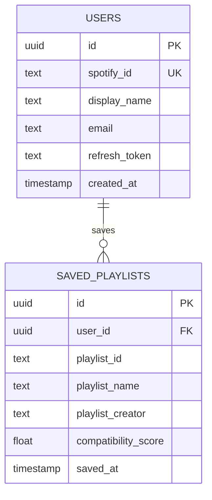

# Curatify

## 1. Problem Statement
Spotify's algorithmic recommendations such as Daily Mixes, Discover Weekly, Release Radar etc., are all caught up in a feedback loop. The more users listen to a genre or artist, the more similar music they are shown. More specifically, Daily Mixes recycles the same songs users have heard before, leaving them bored. Meanwhile, Discover Weekly takes the opposite approach and presents songs that are too different from the user's actual taste or over-emphasises on whichever genre they listened to that week. Spotify presents a playlist by keyword, but has no awareness for what a specific user has an affinity for. Real people are better at curating "vibes" than algorithms because they understand context, mood, and the nuance of why a song fits a playlist, and unlike Spotify's recommendation engine, they aren't incentivised to advertise for certain artists. That said, we want to help users who are frustrated by Spotify's algorithm discover human-curated public playlists that match their listening habits.

## 2. Proposed Solution
A web application that connects to Spotify via OAuth and builds a user's ‘Taste Profile’ from their top artists and the genre tags associated with those artists. Instead of generating new playlists algorithmically, the app searches Spotify for existing public, human-curated playlists and ranks them using a Compatibility: the percentage of a playlist's genres/artists that overlap with the user's Taste Profile. Each playlist also displays a Discovery Rate which is the percentage of its tracks by artists the user doesn't already listen to, so users can see how much genuinely new material a playlist offers on top of its taste match, without that number affecting the ranking itself. The goal is to connect users with playlists made by real people whose taste aligns with theirs, addressing both failures of Spotify's own recommendations for users: Daily Mixes' lack of variety and Discover Weekly's unreliable taste-matching. Users log in, see a dashboard summarising their taste profile (top genres/artists), and are shown a card-based grid of ranked playlists they can save to their Spotify library or bookmark for later.

$$\text{Soulmate Score} = \frac{\text{overlapping genres/artists}}{\text{playlist's total genre/artist count}} \times 100$$

$$\text{Surprise Factor} = \frac{\text{unheard tracks in playlist}}{\text{total tracks in playlist}} \times 100$$

### UI Description:
 - **Landing Page:** app name, one-line pitch, "Login with Spotify" button.
 - **Dashboard:** user's top genres and top artists, displayed as simple lists/tags.
 - **Results Page:** card grid of playlists. Each card shows playlist name, creator, Compatibility (%), Discovery Rate (%), and two buttons: "Save to Library" (adds directly via Spotify API)

The following are links to the Figma Mockups:
Visit [this link](https://drive.google.com/file/d/13CEoNT1A5qXJdjSl6V95z2PbcqV_s-2_/view?usp=drive_link) to see the login page.
Visit [this link](https://drive.google.com/file/d/1KRSTRgYsR4VmbnN9qE6tpSNBv3mijEZv/view?usp=drive_link) to see the dashboard.
Visit [this link](https://drive.google.com/file/d/1Z2bPFdgIx8TdXrM-zXB-bYDLoLFJ9Yak/view?usp=drive_link) to see the  playlists page.

## 3. User Flows
1. User logs in with Spotify
2. Pull their playlists and saved/recent tracks
3. Build a “listened to” set of track IDs/artists
4. For each user playlist, detect genre/style patterns
5. Search Spotify for similar artists/tracks
6. Filter out anything already listened to
7. Suggest songs or generate a new playlist

## 4. Architecture
- **Frontend:** A React (Vite) single-page app with four main views: Landing, Dashboard, Results, and Saved for Later. Each playlist is rendered using a single reusable PlaylistCard component fed different data as props, keeping the results grid consistent and easy to restyle in one place.
- **Backend API:** A Node.js + Express REST API. The backend only returns JSON (structured data) and React is responsible for turning that data into the actual UI.
Here are our planned endpoints + Accepts/Returns:
    - GET:
        - /auth/login → returns: redirects to Spotify’s authorization page
        - /auth/callback → accepts: authorization code, returns: exchanges code for access/refresh tokens, creates a session, redirects to Dashboard
        - /api/profile → accepts: session/auth token, returns: user’s top artists + derived genre list
        - /api/playlists → accepts: session/auth token, returns: ranked list of candidate playlists with Compatibility + Discovery Rate
        - /api/saved → accepts: session/auth token returns: user’s bookmarked playlists
    - POST:
        - /api/saved → accepts: {playlistId} + session/auth token, returns: bookmarks a playlist for the user, returns updated saved list
        - /api/library/:playlistId → accepts: session/auth token, returns: calls Spotify API to save the playlist directly to the user’s library
    - DELETE:
      - /api/saved/:playlistId → accepts: session/auth token, returns” removes a bookmark

- **Database: PostgreSQL (via Supabase):**
    - We purposefully do not have a taste_profiles table. This is because taste profile and playlist scores are recomputed live on each request rather than cached in our database, this keeps the profile current.
    - We can ask Spotify for the user’s top artists every time based on the last 6 months of listening.
        - ex. If a user opens their Dashboard on July 9th, the backend makes this request: GET /me/top/artists?time_range=medium_term. Spotify’s response is based on their listening over the last 6 months. Our backend gets a live answer, uses it to build the Taste Profile, and then does not save it. If the user comes back tomorrow, we make that exact same live request again and Spotify presents us an updated 6-month view.

## 5. Tech Stack
- **Frontend: React + Vite:**
    - React makes it easy to build interactive UI elements such as the card-based playlist grid. This is because we can build one card component with a playlist’s name, creator, etc. and reuse that same card multiple times for each playlist, this keeps our code clean and makes it easy to change how all playlist cards look at once.
    - Vite is to take our React code and turn it into a working website in a browser. Hot reload also allows us to instantly see any changes we’ve made during development. 

- **Backend: Node.js + Express:**
    - Node.js allows us to share code between front and back end easily, it is the runtime environment that allows us to program the backend in javascript
    - Express is a small framework that allows us to use easy API calls such as:
        - GET /api/playlists
        - GET /api/recommendations
        - POST /api/create-playlist
    - Without express, API calls are less logical and readable to the developer.
    - This node + express combination was chosen firstly because it’s lightweight and easy to use, and secondly because it aligns with our javascript frontend.

- **Database: PostgreSQL (via Supabase):**
    - There are lots of relationships we need to store in the data - data that could be stored in a table easily. Storing favourite songs, playlists, dates listened to songs, dates downloaded, etc. is all easy to store in a table format, making PostgreSQL the choice of database (via Supabase). MongoDB was not chosen because data is stored in JSON documents instead of tables, which is okay but tables work better for our purpose.

- **Authentication: Spotify OAuth:**
    - Using Authorization Code Flow, users login on Spotify’s website instead of ours and allow our app permission to read their top tracks. This is easier and safer because we won’t need to handle passwords and users do not need to create an account. User logs in on Spotify’s website → Spotify gives our backend a temporary code → Our backend exchanges that code for an access token.

- **Deployment: Vercel (frontend) + Render or Railway (backend):**
    - Vercel is designed for frontend apps such as React. It’s incredibly simple for us to use because we can connect our repo and every time we push code, Vercel automatically builds and deploys our frontend (we also get a free domain!)
    - Render is simply a host for our backend servers. Similar to Vercel, we can connect our repo and redeploy automatically on push, which is great to see changes quickly.

## 6. Out of Scope 
- We are NOT building: 
    - Social features
    - Algorithmically-generated playlists (we are deliberately filtering these out)
    - User accounts separate from Spotify
    - Any search feature - the app simply puts out the recommended playlist

## 7. Security Considerations
- Verification: users are authenticated via Spotify OAuth - they accept the permissions given by Spotify OAuth, which then provides a token to the backend for their ID.
- Authorization: Every database row will be tied to a user ID, so that the user can only access what is theirs. There won’t be a search function, so the only concern is showing the user what they are meant to be seeing. Since we are using Spotify OAuth, the token the backend is given tied to their account will only allow for their info to be accessed.
- Sensitive Data: We will store the user ID, an access token, a refresh token, playlist/song metadata, and recommendation history. We are not storing passwords. We will be hiding the CLIENT_ID and CLIENT_SECRET that Curatify uses to communicate with spotify. Our database URL will also be hidden.
- Exposed Endpoints: /auth/login and /auth/callback are intentionally public (they're part of the login flow so they must be reachable by anybody in order to get the user logged in). All /api/* endpoints are checked for a valid authenticated session/token because they deal with personal data, if it’s missing or invalid (unauthenticated requests) it returns a 401 (unauthorised error) rather than any data.
    - For example, a stranger cannot type our API’s URL directly into their browser and see someone else’s saved playlists. So the backend checks: “does this request include a valid token proving who you are?”
- Input Validation: The only user input we accept is the Spotify ID of playlists which will be validated against expected Spotify ID format.
    - For example, when a user clicks “Save Playlist”, our frontend sends the playlist to our backend so it knows which playlist to bookmark, but it won’t blindly trust what gets sent, so before saving anything it will check if the ID actually looks like a real Spotify playlist ID (a fixed length string of numbers and letters). If it doesn’t match, it will reject it. Furthermore, we will prevent SQL injection through using parameterised queries (using placeholders instead of directly embedding playlist IDs) to ensure user-supplied input is treated strictly as data and not executable code. 

## 8. Branch Protections
- Require pull request reviews before merging
    - All changes must be submitted via pull request
    - No direct pushes to main are allowed
    - Requires at least 1 approving review before merging
- Dismiss stale pull request approvals when new commits are pushed
    - If a reviewer approves a PR, but then new code is pushed, the approval is automatically dismissed
    - This ensures reviewers see the final version of the code before merging
- Require branches to be up to date before merging
  - The PR branch must be up to date with main before it can be merged
  - Prevents merging code that might conflict with recent changes
- Include administrators in these rules
  - Even repository administrators must follow these rules
  - Ensures no one can bypass the review process

## 9. Open Questions
- How many candidate playlists should we pull per search term before scoring, to keep API calls and load times reasonable?
- What happens if a user's top artists have very few or overlapping genre tags (e.g., a user who only listens to one genre), does Compatibility become meaningless in that edge case?
- Should "Discovery Rate" account for artists the user has listened to but not recently (e.g., a year ago), or only their current top artists?
- Do we save what playlists that have been recommended to them, so that if they recompute, they aren’t recommended to the same ones?
